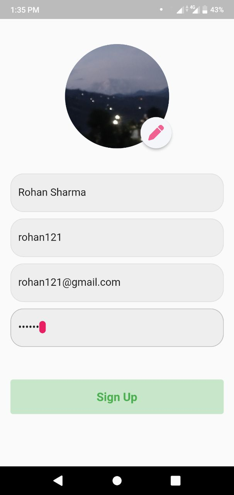
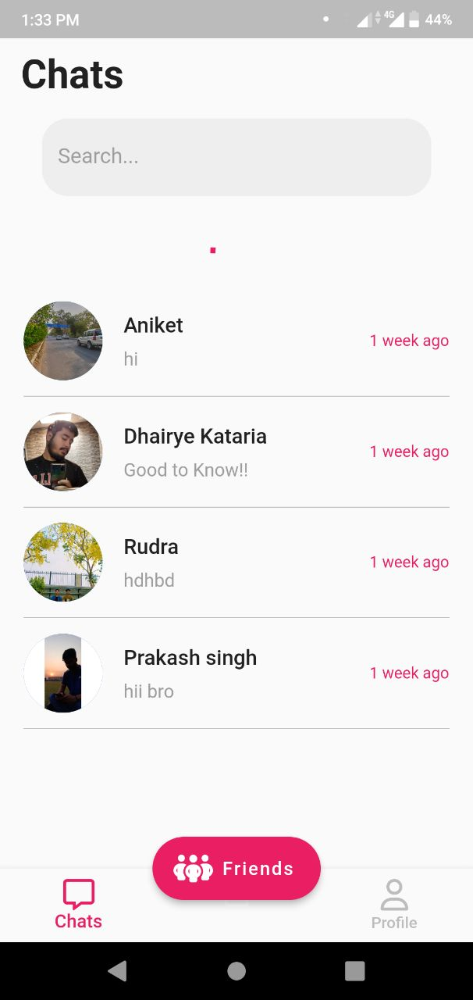
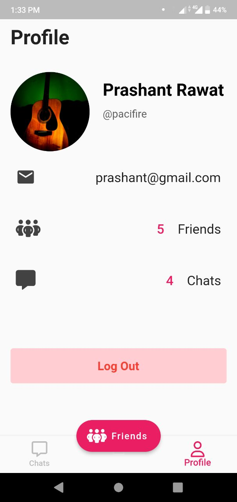

# Backend code repository for the Chat Application
## Technologies used
For frontend, Flutter has been used
 
For backend, express.js, node.js has been used for setting up the server.
 Heroku platform has been used to deploy the node server
 For database, MongoDB Atlas cloud database has been used.
  
Here are some screenshots for the app:
Splash screen:
 

 
Login screen:

 
Signup screen:

 
Contacts screen:

 
User Profile section:

 
Chat Screen:

 
